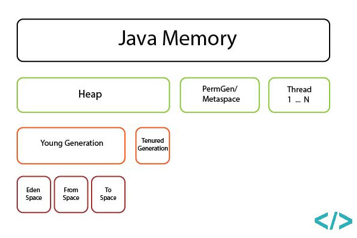

# Troubleshooting java applications

This tools provides some scenarios, that are most commonly cause problems to java applications.
One can use it to gain some experience in troubleshooting, these cases.

## Building
```bash
./gradlew build
docker build . -t epam/jtrouble
```

## Scenario

To run a scenario, simply do `java -jar {jarname} {scenario_name} <additional parameters>`

### Blocking IO

```bash
java - jar {jarname} blocking-read ${port}
```

Args:
 - port, default = 2789

In this scenario, application works in single thread, accepts TCP connection and blocks until client closes socket.
The problem is - if for some reason network is down, but socket is open, it will be blocked forever.

Typical problem - is a web application that works with relational database through jdbc(which is blocking by design).
Under the hood:
 - Application accepts http connection, and blocks servlet thread
 - Application attempts to make some operation in DB using pooled jdbc connection
 - JDBC op blocks on read or write, as it wasn't closed, but network connection with DB is lost
 - Every new http connection will hang, and when servlet thread pool is empty, application stops accepting new connections

*Reproducing:*

```bash
scripts/launch_blocking_read.sh

# in new terminal
telenet localhost 2789

# in new terminal,
ifdown lo

# check application output
ifup lo
```

*Troubleshooting:*

```bash
scripts/print_thread_stack.sh
```

Look for threads that have `.read` in stack.
You can see something similar to:

```
   java.lang.Thread.State: RUNNABLE
	at java.net.SocketInputStream.socketRead0(Native Method)
```

which means thread is not running, but is blocked by IO operation.

*Fixing:*
- fix root cause - network connectivity, block device failure, etc.
- restart application

*Avoiding:*
- use NIO(non-blocking IO) vs IO, f.ex. servlet containers have such feature

### CPU Flooding

In this scenario, application works in n*threads equals to number of CPU cores. Each thread is making intensive computations,
causing all CPU cores to show ~100% utilization.

Typical problem - badly written application, f.ex. - infinite loops, n+1 computations

*Reproducing:*

```bash
scripts/launch_cpu_intensive.sh
```

*Troubleshooting:*

Make thread dump when you see high cpu loads. Search for `RUNNABLE`, compare with previous dumps.
```bash
scripts/print_thread_stack.sh
```

*Fixing:*
 - Fix software
 - In case of scheduled jobs, reschedule to non-business hours

*Avoiding:*
 - Cases like n+1 can be detected by static code analyzers like Sonar
 - Any CPU heavy scheduled process should be documented
 
### Dead Lock
 
This scenario does not often happen, but still worth discussing due to it's mystical nature - classic java *dead lock*.
Due to it's multithreaded nature, to avoid problems with shared resources java heavily utilizes [Monitor pattern](https://en.wikipedia.org/wiki/Monitor_(synchronization))


*Reproducing:*

```bash
scripts/launch_thread_lock.sh
```

*Troubleshooting:*

Make thread dump, check if there is `Found xxx Java-level deadlock` statement.
There could also be situations when threads are locked, but this will not appear, look for `BLOCKED` threads
```bash
scripts/print_thread_stack.sh
```

*Fixing:*
 - Fix software that causes thread lock
 - Restart application as temporary workaround
 
*Avoiding:*
 - Sometimes can be found by static code analyzers like Sonar
 - Dev team should avoid using low-level `synchronized` in favor of `java.util.concurrent`, any pull requests containing it
 should be carefully reviewed and tested. Can also be part of code-review agreement.
 
### Heap Memory issues

One of the most common problems with java software. It does not require user to explicitly deallocate memory (like you would
in c++ f.ex.), instead using GC to do this work. This leads to a number of problems itself, also misunderstanding of what GC
is, may lead to some unreasonable decisions, like giving java as much memory as you have.

In this example, I will control memory with only `-Xmx` parameter, you can however find a lot more in [official docs](https://docs.oracle.com/cd/E13150_01/jrockit_jvm/jrockit/jrdocs/refman/optionX.html)

Also, before looking into examples, we should take a look at a



GC types, their pros and cons described in [this blog](http://eivindw.github.io/2016/01/08/comparing-gc-collectors.html)

#### Problem1
Application throws OOM, but then continue to work without problems.

```bash
scripts/launch_heap_local.sh
```

*Troubleshooting:*
 - Can be found in application logs
 - Use monitoring
 
*Fixing:*
 - Fix software that causes issues
 - Restart as workaround
 - OOM log should be helpful
 
*Avoiding:*
 - Application should be tested for edge cases, such as high load, uploading or processing big files, etc.

#### Problem2
Application throws OOM, stops responding or crashes

```bash
scripts/launch_heap_global.sh
```

*Troubleshooting:*
 - Can be found in application logs
 - Use monitoring
 - Use healthchecks
 - Make full heapdump before restart
 
*Fixing:*
 - Restart application
 - Analyze heapdump to find cause
 - Fix software that causes issues
 
*Avoiding:*
 - Application should be tested for edge cases, such as high load, uploading or processing big files, etc.
 - Use `-XX:+HeapDumpOnOutOfMemoryError -XX:OnOutOfMemoryError`

#### Problem3
Application heavily utilizes heap, does not throw OOM, may eventually go down on memory when almost reached maximum.

```bash
scripts/launch_heap_soft.sh
```

*Troubleshooting:*
 - Use monitoring
 - Make heapdump
 - Enable GC logging, analyze gc log
 
*Fixing:*
 - Analyze heapdump to find cause
 - Is most likely caused by in-memory caches like ehcache, hazelcast, etc. Tune it
 
*Avoiding:*
 - Set a reasonable size of heap
 - Load test application on env similar to prod before going to prod
 
For monitoring this sample application you can use `launch_jconsole.sh`, `print_gc_log.sh` and `print_gc_pauses.sh`
 
### Too many open files

This error often happens on linux systems with default limits. F.ex. ubuntu has by default `nofile=1024`, which means you
can have no more than 1024 sockets open concurrently.

*Troubleshooting:*
 - You can see this error in log
 - Use ulimit -n to find current limit
 
*Fixing:*
 - Increase `nofile` to some reasonably high value
 
*Avoiding:*
 - Be sure to change these values when you provision instances
 
 ### StackOverflow
 
 This error usually indicates that application makes too many recursive calls.
 Also in rare situations can be caused by not enough space specified for thread, or lots of references being created.
 
*Reproducing:*
 
 ```bash
 scripts/launch_stack_overflow.sh
 ```

*Troubleshooting:*
 - You can see this error in log

*Fixing:*
 - Fix software bug
 - Increase `-Xss` if this is not a bug

*Avoiding:*
 - Unit testing should include edge scenarios
 
### Thread Leak

One of the hard-to-find bugs. May cause application to utilize more and more memory with time, over -Xmx limit.
 
*Reproducing:*
 
 ```bash
 scripts/launch_thread_leak.sh
 ```


*Troubleshooting:*
 - If the memory hits OS limits, you can see it in logs
 - Use `jstack` or `pmap` to find thread number


*Fixing:*
 - Decrease `-Xss` to limit threads memory (1024k by default)
 - Adjust `sys.kernel.threads-max` in `/etc/sysctl.conf`, will cause to fail-fast
 - Fix software bug, that causes thread leak
 
*Avoiding:*
 - Dev team must use thread pools over creating single threads
 - All threads must have name, that indicates why it was created
 - Dev team should close executors/thread pools, when no longer needed, releasing threads